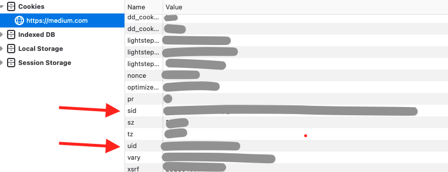

# Extract Daily Medium Stats

Github Action to Extract Medium Stats daily and notify via [Gotify](https://github.com/gotify).

## Project Setup

1. Fork this repo
2. Add Enviornment "Production" at `https://github.com/<username>/medium_stats/settings/environments`
3. Add Secrets in Environment
   1. `MEDIUM_UID`: Go to medium.com -> Log In -> Open Developer Tools -> Storage -> Cookie -> `uid`
   2. `MEDIUM_SID`: Go to medium.com -> Log In -> Open Developer Tools -> Storage -> Cookie -> `sid`
   3. `GOTIFY_URL`: Get it from your gotify server.

